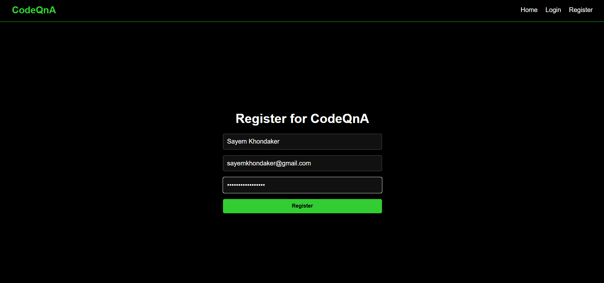
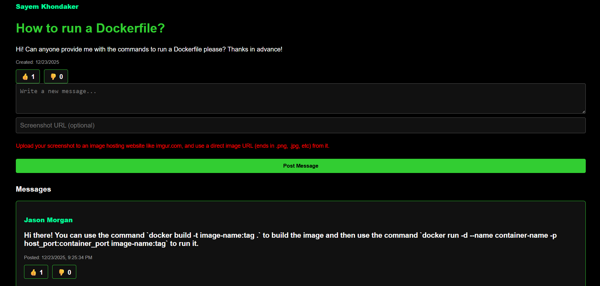
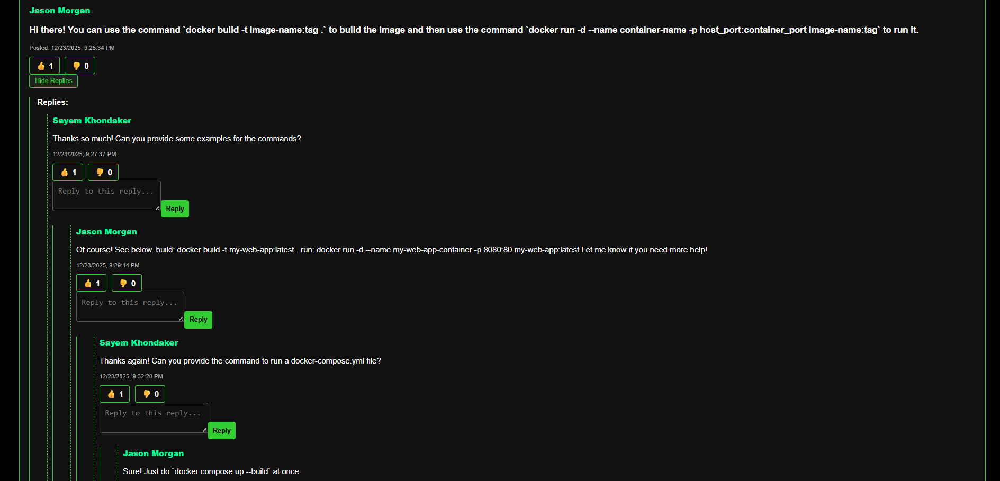
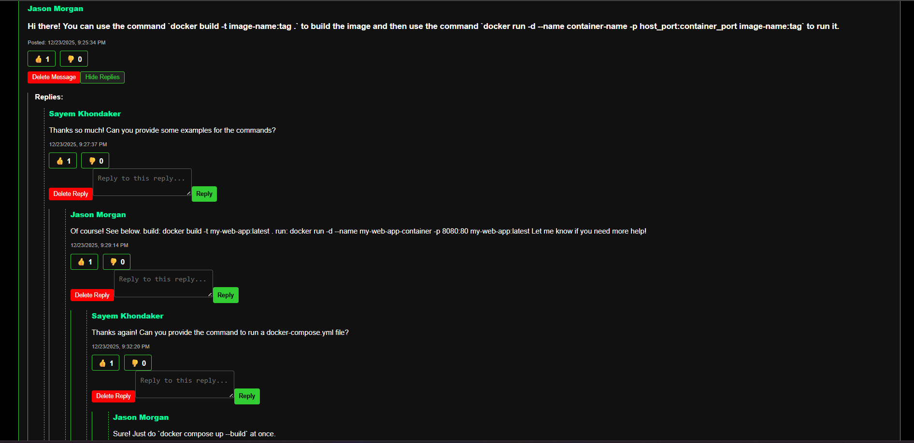

# CodeQnA — Full-Stack Q&A Web Application

CodeQnA is a full-stack Question & Answer web application that allows users to create discussion channels, post questions, replies, and participate in threaded conversations.  
It was originally developed as a solo full-stack project during university coursework and later polished for portfolio use.

The project demonstrates backend API design, relational database modeling, authentication, and containerized deployment using Docker.

---

## ✨ Features

- User authentication with session management
- Channel-based discussion system
- Threaded messages and replies
- Role-based access (admin actions)
- RESTful API built with Node.js and Express
- Relational database design using MySQL
- Dockerized backend and database services
- Environment-based configuration using `.env` files

---

## 📸 Screenshots

### User Authentication


### Channel Page


### Threaded Discussions


### Admin View


---

## 🛠️ Tech Stack

**Frontend**
- React (Create React App)
- CSS

**Backend**
- Express
- MySQL

**DevOps / Tooling**
- Docker
- GitHub

---

## 🚀 Getting Started (Recommended: Docker)

The easiest way to run this project locally is using Docker.

### Prerequisites
- Docker

### Setup
1. Clone the repository:
   ```bash
   git clone https://github.com/Sayem-75/CodeQnA.git
   cd CodeQnA
   ```
2. Create a .env file using the example provided:
   ```bash
   cp .env.example .env
   ```
   Update the environment variables as needed.
3. Build and start the application:
   ```bash
   docker-compose up --build
   ```
4. The backend server will be available at:
  ```bash
  http://localhost:3000
  ```

---

## 🧪 Alternative: Run Without Docker (Development Only)

This option is intended for development and debugging.

### Backend
```bash
cd backend
npm install
npm start
```

### Frontend
```bash
cd frontend
npm install
npm start
```

A local MySQL instance is required when running the project without Docker.

---

## 🔐 Environment Variables

Sensitive configuration values are managed using environment variables.
No secrets or credentials are committed to the repository.

Refer to `.env.example` for the required environment variables.

The application reads all configuration values from environment variables and does not require any code changes in `server.js`.

---

## 🌐 Deployment

The backend API can be deployed to cloud platforms such as Render.
For simplicity and reproducibility, this project is primarily intended to be run locally using Docker.

---

## 📌 Notes

- Database dump files and sensitive configuration files are intentionally excluded from version control.
- This project focuses on demonstrating full-stack integration, backend architecture, and database design.

---

## 📄 License

This project is provided for learning and portfolio purposes.


